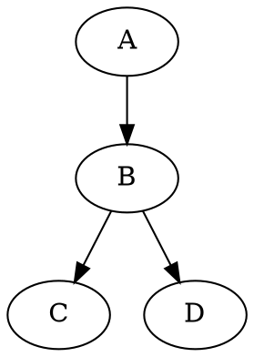

# vitepress-plugin-graphviz

> A plugin that renders Graphviz DOT diagrams with light/dark theme support.

<version-badge package="vitepress-plugin-graphviz" />

## Installation

```sh
npm i -D vitepress-plugin-graphviz // [!=npm auto]
```

## Usage

After installing the plugin, you'll need to edit both [App Config](https://vitepress.vuejs.org/config/app-configs) and [Theme Config](https://vitepress.vuejs.org/config/theme-configs).

```ts
// .vitepress/config.ts
import { defineConfig } from 'vitepress'
import { graphvizMarkdownPlugin } from 'vitepress-plugin-graphviz'

export default defineConfig({
  markdown: {
    async config(md) {
      await graphvizMarkdownPlugin(md)
    },
  },
})
```

```ts
// .vitepress/theme/index.ts
import type { Theme } from 'vitepress'
import DefaultTheme from 'vitepress/theme'
import 'vitepress-plugin-graphviz/style.css'

export default {
  extends: DefaultTheme,
} satisfies Theme
```

## Syntax

### Basic DOT diagram

Use ` ```dot ` code fences to render Graphviz DOT language into SVG.

````md

````


### Light/dark theme colors

Use `${light_value|dark_value}` to specify different values for light and dark themes. Escape with `$${` to produce a literal `${`.

````md
```dot
digraph {
    bgcolor="transparent";

    node [style=filled, fillcolor="${#e8f4f8|#1a3a4a}", fontcolor="${#333|#ddd}"]
    edge [color="${#666|#aaa}"]
    A [label="Start"]
    B [label="End"]
    A -> B
}
```
````

```dot
digraph {
    bgcolor="transparent";

    node [style=filled, fillcolor="${#e8f4f8|#1a3a4a}", fontcolor="${#333|#ddd}"]
    edge [color="${#666|#aaa}"]
    A [label="Start"]
    B [label="End"]
    A -> B
}
```

### Processors

Register custom processors to transform content before rendering (preprocess) and/or modify the rendered SVG after rendering (postprocess). Use ` ```dot+name ` where `name` matches a key in the `processors` option.

You can also pass attributes on the fence line (e.g., ` ```dot+name maxWidth=500 `), which are forwarded to both hooks.

```ts
// .vitepress/config.ts
import { graphvizMarkdownPlugin } from 'vitepress-plugin-graphviz'

export default defineConfig({
  markdown: {
    async config(md) {
      await graphvizMarkdownPlugin(md, {
        processors: {
          'my-dsl': {
            preprocess: (content, attrs) => {
              // transform content into DOT
              return `digraph { ${content} }`
            },
            postprocess: (svg, mode, attrs) => {
              // modify rendered SVG (e.g., set max width)
              const maxWidth = attrs.maxWidth
              if (maxWidth) {
                return svg.replace(
                  '<svg',
                  `<svg style="max-width:${maxWidth}px"`,
                )
              }
              return svg
            },
          },
        },
      })
    },
  },
})
```

Then use it in markdown:

````md
```dot+my-dsl maxWidth=500
A -> B -> C
```
````

#### Fence attributes syntax

Attributes are specified after the processor name on the fence line:

| Syntax              | Parsed as                |
| ------------------- | ------------------------ |
| `key=value`         | `{ key: "value" }`       |
| `key="quoted text"` | `{ key: "quoted text" }` |
| `flag`              | `{ flag: "true" }`       |

Example: ` ```dot+name maxWidth=500 title="my graph" responsive ` parses as `{ maxWidth: "500", title: "my graph", responsive: "true" }`.

## Options

| Option       | Type                        | Default                     | Description                     |
| ------------ | --------------------------- | --------------------------- | ------------------------------- |
| `cacheDir`   | `string`                    | `.vitepress/cache/graphviz` | Directory for cached SVG files  |
| `processors` | `Record<string, Processor>` | `{}`                        | Custom processors keyed by name |
